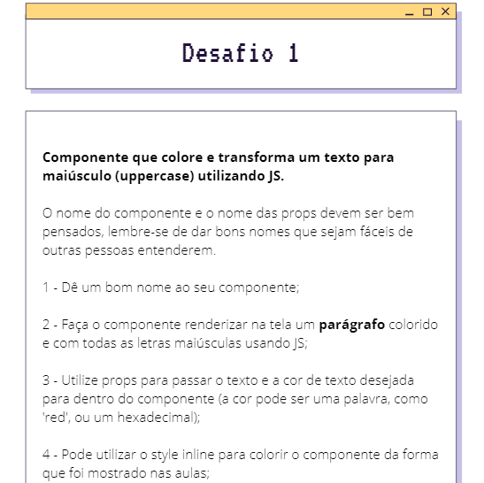

<h1 align='center'>
    
    
Quest React Base - DevQuest

</h1>

### 📖 About

Essa é uma quest que envolve a base sobre o React do Curso DevQuest.

### Quests:

    
    

### Resolution:

    

### Tecnologias utilizadas:

    <ul>
        <li>CSS</li>
        <li>JAVASCRIPT</li>
        <li>REACT</li>
    </ul>

